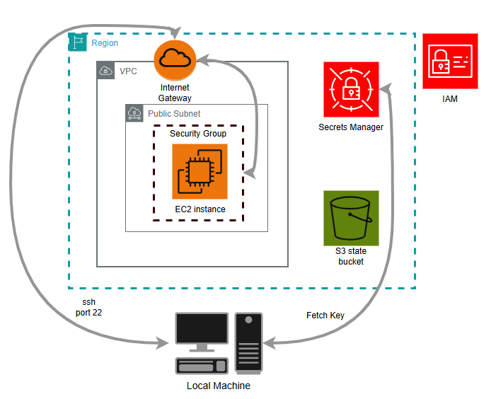

# remotf - EC2 version

The v1 implementation of remotf. A persistent EC2 instance acts as a remote Terraform execution host. Your local machine syncs code over rsync and proxies commands over SSH. Simple, fast, and the foundation that motivated the Fargate rebuild.

---

<div align="center">
  
</div>

---

## How it works

A single bash script - `remotf.sh` - handles everything:

1. Checks if the EC2 runner exists by reading terraform output. If not, provisions it automatically
2. Fetches the SSH private key from AWS Secrets Manager and caches it locally
3. Syncs your project files to the instance using rsync over SSH, excluding `.terraform`, `.git`, and zip files
4. Compares your local `.terraform.lock.hcl` hash against the remote — only re-runs `terraform init` if providers changed
5. Runs the requested terraform command on the remote instance and streams output back to your terminal

The SSH key is generated by Terraform, stored in Secrets Manager, and fetched automatically on first use. You never manage keys manually.

---

## What gets provisioned

Running `remotf.sh` for the first time provisions:

- A `t3.medium` EC2 instance running Amazon Linux 2023
- An IAM role with the permissions you specify
- A security group that allows SSH only from your current public IP
- An S3 bucket for remote state with versioning and encryption enabled
- The SSH keypair stored in Secrets Manager

---

## Prerequisites

- AWS CLI configured with credentials
- Terraform installed locally
- WSL (Windows Subsystem for Linux) - the script uses WSL for rsync and SSH

---

## Configuration

Create a `terraform.tfvars` file in the EC2 version folder:

```hcl
region         = "us-east-1"
runner_policy  = "arn:aws:iam::aws:policy/AdministratorAccess"
```

`runner_policy` accepts any IAM policy ARN — AWS managed or customer managed. It controls exactly what permissions the EC2 runner has when executing your Terraform. Default is `AdministratorAccess` for convenience but you should scope this down to only what your infrastructure actually needs.

If your project uses a backend config file with sensitive values, pass it as the second argument:

```bash
./remotf.sh apply backend.conf
```

---

## Usage

### Option 1 — run directly

From your Terraform project directory:

```bash
# apply (default)
./remotf.sh

# explicit apply
./remotf.sh apply

# plan
./remotf.sh plan

# destroy
./remotf.sh destroy
```

### Option 2 — use as a CLI tool

Add this function to your `.bash_profile` to call remotf from any directory like a native command:

```bash
remotf() {
  local TARGET_DIR="/path_to_EC2_Version/remotf_project"
  bash "$TARGET_DIR/remotf.sh" "$@"
}
```

Then reload your profile:

```bash
source ~/.bash_profile
```

Now from any Terraform project directory:

```bash
remotf apply
remotf plan
remotf destroy backend.conf
```

---

## Known limitations

- **Windows + WSL only** — the script uses `wslpath` and WSL bash for rsync and SSH. Does not run natively on Linux or Mac without modification
- **Single-tenant** — one instance shared across runs. Concurrent executions from multiple developers will conflict
- **Persistent idle cost** — the instance runs 24/7 unless you manually stop or destroy it
- **Environment drift** — the instance accumulates state between runs. A bad run can affect the next one
- **SSH surface area** — port 22 is open to your public IP. Key rotation and IP changes require manual intervention

---

## Why this version exists

This was the first implementation — built to prove the concept worked. It does. But daily use exposed the idle cost, the single-tenant limitation, and the environment drift problem. Those are the reasons the [ECS Fargate version](../ECS_Version/) exists.
