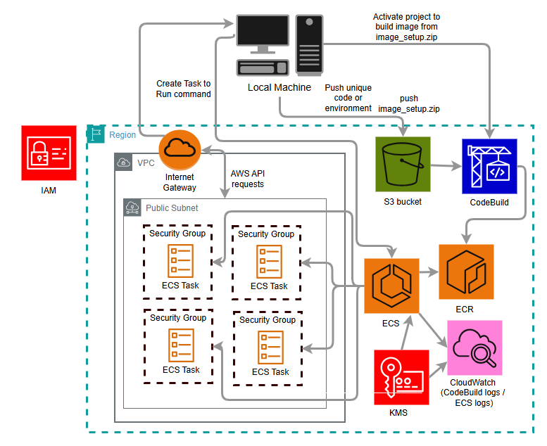

# remotf - ECS Fargate version

The v2 implementation of remotf. Every terraform command runs inside an isolated, ephemeral Fargate container. Your local machine sends the instruction, AWS does the work, logs stream back to your terminal. When the container exits, nothing persists - no idle cost, no environment drift, no cleanup needed.

remotf is a fully self-contained CLI tool built with Python and [Typer](https://typer.tiangolo.com/). Once installed, it works as a native terminal command from any directory. No scripts to source, no paths to manage.


---

<div align="center">
  
</div>

---

## Architecture

remotf is split into two completely separate concerns: **setup** and **execution**. Understanding this separation is key to understanding how the tool works.

### Setup - runs once ever

`remotf setup` provisions everything remotf needs to operate and builds the worker image. You run this once and never again unless you tear it down.


**What gets provisioned:**

- **ECS Fargate cluster** - with container insights enabled and KMS-encrypted execute command logging
- **ECR repository** - stores the worker Docker image
- **CodeBuild project** - builds the Docker image from source and pushes both `latest` and a timestamped tag to ECR
- **S3 bucket** - stores code archives, provider caches, and your project terraform state
- **IAM roles** - execution role for ECS infrastructure, task role for your terraform code
- **KMS key** - encrypts CloudWatch logs, ephemeral container storage, and execute command sessions
- **CloudWatch log group** - receives all container output, 1 day retention
- **VPC and networking** - configurable, uses your existing default VPC of the configured region by default

**The worker image** is built by CodeBuild from the `image_setup` folder. It contains:
- Amazon Linux 2023 minimal base
- AWS CLI v2
- Terraform 1.14.0
- The entrypoint script
- A non-root `remotf` user for least privilege execution

The image is tagged `latest` and with a timestamp so every build is traceable. `remotf setup` streams the CodeBuild logs live so you can watch the image being built.

**State migration** happens automatically after provisioning. remotf creates its own `backend.tf`, migrates its infrastructure state to the S3 bucket it just created, and cleans up local state files. After setup, remotf's own state is fully remote.

---

### Execution - runs every time

`remotf apply` and `remotf destroy` are the commands that actually do work. Every execution follows the same flow:

1. remotf hashes your code and `.terraform` folder locally
2. Uploads only what changed to S3 - code and provider cache are stored separately so a one-line `.tf` change never re-uploads 100MB of providers
3. Launches an ECS Fargate task with the S3 keys and terraform command passed as environment variables
4. The container pulls your code and provider cache from S3, wires up the backend, and runs the terraform command
5. Logs stream live from CloudWatch back to your terminal as the container runs
6. When the container exits, remotf reads the exit code and surfaces it - a failed apply returns non-zero so it integrates cleanly with scripts and pipelines

**1. Content-addressed caching**

Before launching anything, remotf hashes your project:

- **Code hash** - MD5 of all `.tf` files and project content. If unchanged, the existing S3 archive is reused
- **Env hash** - MD5 of your `.terraform` folder. If providers haven't changed, the existing cache is reused


```
s3://remotf-bucket/
├── code/{code_hash}.zip     ← your .tf files
├── env/{env_hash}.zip       ← your .terraform folder
└── states/                  ← your project terraform state
```

Only what changed gets uploaded. A provider cache can be 100MB+. Re-uploading it every run would be painful. The hash ensures you never do.

**2. Bootstrap detection**

On first run for a new project, remotf runs `terraform state list` locally. Empty state means the project has never been applied - the container runs a bootstrap sequence:

init -backend=false → apply → migrate state to S3

On every subsequent run, state exists, bootstrap is skipped, and the normal flow runs.

**3. Container execution**

A Fargate task starts with your S3 keys and terraform command passed as environment variables. Inside the container:

```bash
# pull code
aws s3 cp s3://{bucket}/{code_key} ./project.zip
unzip project.zip -d ./workdir
cd ./workdir

# restore provider cache
aws s3 cp s3://{bucket}/{env_key} ./env.zip
unzip env.zip && rm env.zip

# wire up backend
terraform init -reconfigure [-backend-config=backend.conf]

# run the command
terraform apply -auto-approve
```

**4. Log streaming**

Once the container is running, logs stream live to your terminal via CloudWatch. The experience is designed to feel like running terraform locally - you see every line as it happens.

**5. Exit code propagation**

After the container stops, remotf reads the exit code and surfaces it. A failed apply returns a non-zero exit code to your terminal so it integrates cleanly with scripts and CI pipelines.

---

## Prerequisites

**AWS:**
- AWS CLI configured with credentials

**Terraform:**
- Terraform >= 1.11.0 installed locally - used for `remotf init` and `remotf plan` which run locally

**Python:**
- Python >= 3.10
- pipx - used to install remotf as a native CLI tool

---

## Installation

remotf is installed via pipx which isolates it in its own environment and puts it on your PATH automatically. This avoids dependency conflicts and path issues.

```bash
python -m pip install pipx
python -m pipx ensurepath
```

Restart your shell, terminal, or editor after running `ensurepath` so the PATH change takes effect.

Then install remotf directly from GitHub:

```bash
pipx install GITHUB_REPO_URL
```

Validate the installation:

```bash
remotf --help
```

---

## Setup

```bash
remotf setup --region us-east-1
```

By default the ECS task role gets `AdministratorAccess`. To scope it down to exactly what your terraform needs:

```bash
remotf setup --region us-east-1 --policy-arn arn:aws:iam::123456789012:policy/MyPolicy
```

This is the recommended approach for anything beyond personal use. The task role is what your terraform code runs as - give it only what it needs.

Setup takes 3-5 minutes. CodeBuild logs stream live so you can watch the image build.

---

## Configuration

Create a `.remotf` file in your Terraform project root:

```json
{
  "backend_config": "backend.conf"
}
```

`backend_config` is optional. If your backend block contains sensitive values like bucket names you don't want in git, put them in a separate `backend.conf` file and reference it here. Both files are gitignored and handled automatically.

Add to `.gitignore`:

.remotf

backend.conf

**Using remotf's own S3 bucket for your state:**

The simplest setup - point your backend directly at remotf's bucket:

```hcl
terraform {
  backend "s3" {
    bucket  = "your-remotf-bucket-name"
    key     = "states/my-project/terraform.tfstate"
    region  = "us-east-1"
    encrypt = true
  }
}
```

No separate state bucket needed. remotf's bucket already has versioning and encryption. Your state lives under `states/` and never conflicts with remotf's own infrastructure state at `states/remotf-infra/`.

---

## First time use

Initialize locally once:

```bash
remotf init
```

Then fire and forget:

```bash
remotf apply
```

---

## Commands

| Command | Runs where | What it does |
|---|---|---|
| `remotf setup` | Local | Provisions all AWS infrastructure and builds the worker image |
| `remotf active` | Local | Checks if remotf infrastructure is up and ready |
| `remotf init` | Local | Runs terraform init with backend config handled automatically |
| `remotf plan` | Local | Runs terraform plan locally for fast feedback |
| `remotf apply` | Remote (ECS) | Applies your infrastructure on an ephemeral Fargate container |
| `remotf destroy` | Remote (ECS) | Destroys your infrastructure on an ephemeral Fargate container |
| `remotf cleanup` | Local | Migrates state back locally and tears down all remotf infrastructure |

---

## Security model

**Execution role** - used by ECS itself to set up the container. Has permission to pull from ECR, write to CloudWatch, fetch secrets, and use the KMS key for encrypted storage and logging. Active only during container startup.

**Task role** - used by your terraform code inside the container. Scoped to exactly what you pass via `--policy-arn`. This is the only role that touches your actual AWS resources.

**KMS encryption** - a single customer-managed key encrypts CloudWatch logs, container ephemeral storage, and execute command sessions. No plaintext data at rest.

**No SSH, no inbound ports** - the container communicates outbound only via S3 and AWS APIs. There is no attack surface to reach the running container from outside.

---

## Known limitations

**Cold start** - ECS tasks take 45-90 seconds to provision. For `apply` and `destroy` on real infrastructure this is negligible. For `plan` during active development it is not - run plan locally.

**Dynamic bucket names** - if your state bucket name is generated at runtime, remotf cannot bootstrap automatically. Run these three commands locally once, then use remotf normally:

```bash
terraform init
terraform apply
terraform init -migrate-state
```

**Single root module per run** - remotf runs from your current directory. Multi-module projects work fine but each module is executed as a separate remotf command from its own directory.

---

## Cleanup

```bash
remotf cleanup
```

Migrates remotf's own state back to local, destroys all provisioned infrastructure, and cleans up state files. Asks for confirmation before proceeding. Note: if you stored project state in remotf's S3 bucket, that state will be destroyed too.
