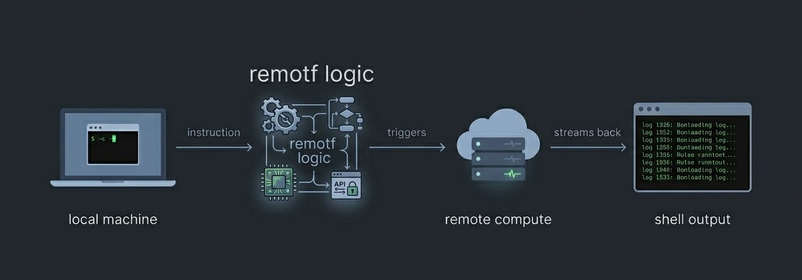

# remotf

  

---

Terraform is typically run locally. For small projects, this works. But as infrastructure scales, the `terraform apply` and `terraform destroy` cycles become deceptively resource-intensive. When local CPU and RAM start hitting their limits just to calculate a graph of resources, the developer experience degrades massivly.

**remotf** is a project born out of necessity. After experiencing local hardware bottlenecks during complex applies, I built this to offload the heavy lifting to the cloud. It is a research and implementation project exploring how to move the entire Terraform execution lifecycle onto AWS compute, turning your local machine into a lightweight command center rather than a primary worker.

This isn't a wrapper around a managed service. It’s a ground-up build of two distinct remote execution patterns designed to understand the mechanics of offloading compute-intensive infrastructure tasks.

---

## The Problem: The Local Resource Wall

The primary driver for this project was the realization that "running locally" has a ceiling. When you move past simple S3 buckets into complex environments, your local machine pays the price:

**Compute Exhaustion** - Large-scale resource graphs and provider plugins are heavy. During a `plan` or `apply`, it’s common to see local **CPU and RAM usage explode**, causing the IDE to lag and the system fans to redline. **remotf** moves this "execution tax" to high-performance AWS instances or containers, keeping your local environment snappy.

**The "Long-Running Task" Trap** - Some resources, like RDS clusters or global CloudFront distributions, take 15+ minutes to provision. Local execution forces you to keep your machine awake and your terminal open. If the process is killed due to a local memory spike or a closed laptop lid, you risk orphaned resources and hung state locks.

**Identity & Role Bottlenecks** - Managing high-privilege AWS profiles locally is an operational headache. By offloading execution, we shift the identity from a local IAM User to a **native IAM Role** attached to the remote compute. This ensures the runner has exactly the permissions it needs, independently of the local machine's configuration.

Remote execution turns the local terminal into an **instruction sender**. The heavy lifting, the state management, and the network-intensive API calls happen where they belong: inside the AWS backbone.

---

## The Implementations

This repository contains two production-grade patterns for achieving remote execution. Each approach represents a different philosophy regarding compute persistence and lifecycle management.
Both implementations follow the same basic contract: your local machine sends an instruction, remote compute executes it, logs come back to your terminal. The difference is everything in between.

### 1. v1: Persistent Execution (EC2)
This version uses a dedicated EC2 instance as a remote workspace. It prioritizes speed and familiarity, using `ssh` and `rsync` to synchronize files and execute commands in real time. The instance is always on, ready to receive commands, and maintains a persistent environment across runs.
* **Best for:** Rapid iteration and developers who want the "feel" of a local terminal with the "identity" of a cloud role.
* **Location:** `/EC2_Version`

### 2. v2: Ephemeral Execution (ECS Fargate)
This version moves toward a "Serverless" execution model. It packages the code into a staging area (S3), spins up a Fargate container using a pre-defined image and configuration, to run the command, and destroys the compute the moment it finishes. 
* **Best for:** Production-grade isolation and zero-cost idle time, supports concurrent executions for multiple users.
* **Location:** `/ECS_Version`

---

## Architectural Comparison
## Deep-dive comparison

The surface-level tradeoffs between the two implementations are straightforward - cold start, cost, complexity. But the architectural differences run deeper than that. This table covers the full picture.

## Architectural comparison

| Feature | EC2 | ECS Fargate |
|---|---|---|
| **Primary driver** | Performance and familiarity | Isolation and scalability |
| **Concurrency** | 🔴 Single-tenant. Shared instance causes file conflicts and state corruption between sessions | 🟢 Multi-tenant. Each developer gets an isolated container. Dozens of applies run in parallel without interference |
| **Compute cost** | 🔴 Fixed. Pay for uptime whether executing or idle. Stops only when you remember to stop it | 🟢 Pay-per-execution. Billing stops the second the container exits. Zero idle cost by design |
| **Operational cost** | 🔴 High. OS patching, SSH key rotation, disk monitoring - all your responsibility | 🟢 Low. Serverless abstraction removes infrastructure maintenance entirely |
| **Network security** | 🔴 Port 22 open to your machine or VPN. Every SSH session is an inbound connection to a live server | 🟢 No inbound ports. Communicates entirely through S3 and AWS APIs. Container never accepts incoming connections |
| **Identity security** | 🔴 Instance profile persists permanently. SSH access = IAM role access for as long as the instance runs | 🟢 Task roles exist only for the container lifetime - minutes. No persistent identity to exploit |
| **Startup latency** | 🟢 Near-zero when instance is running | 🔴 45–90 seconds for image pull and provisioning |
| **Compliance** | 🔴 Manual SSH session logging. Audit trail depends on what you set up | 🟢 Native. Every execution is a discrete CloudWatch event, structured and timestamped automatically |

## From v1 to v2 - what was learned

The EC2 implementation worked. It solved the immediate problem of getting Terraform off the local machine. But operating it over time exposed a set of problems that were fundamental to the architecture, not fixable with patches.

**The babysitting problem persisted.** rsync and SSH kept the local machine active in the execution loop. The terminal still needed to stay open. The local machine was not truly free.

**Idle cost was constant.** An EC2 instance running 24 hours a day costs money whether it executes one apply or a hundred. Forgetting to stop it after a session is a real operational failure mode, not a hypothetical one.

**Environment drift was inevitable.** A persistent instance accumulates state. A manually installed dependency, a changed environment variable, a provider cache that never gets cleared. over time the instance stops being a clean execution environment and becomes a machine with history. Debugging failures requires reasoning about that history.

**There was no isolation between runs.** A failed apply that left behind temporary files or a corrupted provider cache affected every subsequent run on that instance.

**The security model was leaky.** The instance profile was a persistent identity that could be exploited by anyone with SSH access. If the instance was compromised, the attacker had a long-lived foothold in the environment.

**There was no true multi-user support.** Multiple developers sharing the same instance caused file conflicts, state corruption, and a chaotic experience. The instance was effectively single-tenant.

Building v2 was a direct response to each of these. The Fargate implementation enforces immutability by making persistence structurally impossible. Every run starts fresh. The instance cannot drift because it does not persist. The idle cost is zero because there is no idle compute. The local machine is fully free once the task is launched. security is improved by eliminating the persistent identity and attack surface. Multi-user support is inherent in the design, as each run is isolated.

The tradeoff is cold start latency and architectural complexity. For a 15 minute `terraform apply`, a 60 second container startup is negligible. For a 3 second `terraform plan` during active development, it is not. remotf acknowledges this explicitly - plan runs locally, apply and destroy run remotely.

---

